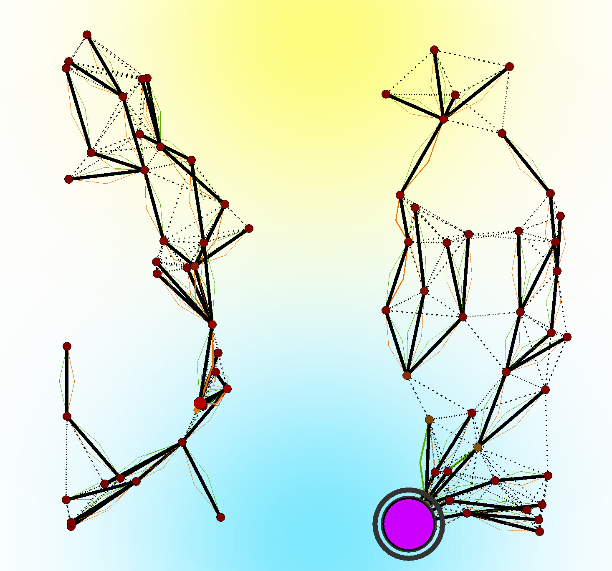

# _FieldVMC: An Asynchronous Model and Platform for Self-organising Morphogenesis of Artificial Structures_

### Authors 

Anonymized for double-blind review

[//]: # (| **Angela Cortecchia** &#40;*&#41; | **Danilo Pianini** &#40;*&#41; | **Giovanni Ciatto** &#40;*&#41; | **Roberto Casadei** &#40;*&#41; |)
[//]: # (|:-------------------------:|:----------------------:|:-----------------------:|:-----------------------:|)
[//]: # (| angela.cortecchia@unibo.it | danilo.pianini@unibo.it | giovanni.ciatto@unibo.it | roby.casadei@unibo.it   |)

[//]: # (&#40;*&#41;)

[//]: # (*Department of Computer Science and Engineering \)
[//]: # (    Alma Mater Studiorum --- Università di Bologna - Cesena, Italy*)

### Table of Contents
- [About](#about)
    * [Experiments](#experiments)
- [Getting Started](#getting-started)
  - [Requirements](#requirements)
  - [Limitations](#limitations)
  - [Understanding the experiments](#understanding-the-experiments)
  - [Walk-through the experiments](#walk-through-the-experiments)
  - [Reproduce the entire experiment](#reproduce-the-entire-experiment)
    * [Simulation Graphical Interface](#simulation-graphical-interface)
    * [Extremely quick-start of a basic experiment -- `(ba|z|fi)?sh` users only](#extremely-quick-start-of-a-basic-experiment----bazfish-users-only)
    * [Reproduce the experiments through Gradle](#reproduce-the-experiments-through-gradle)
    * [Changing experiment's parameters](#changing-experiments-parameters)
    * [Simulation entrypoint](#simulation-entrypoint)
    * [Experiments features recap](#experiments-features-recap)
    

## About

In the field of evolutionary computing, the concept of Vascular Morphogenesis Controller (VMC) 
has been proposed in to model the growth of artificial structures over time.

A thorough analysis of the VMC model revealed some limitations:
- assumes the organization structure is a tree, here intended as a directed acyclic graph with a single root and with a single path connecting the root with each leaf;
- the model is implicitly synchronous, as it assumes that (i) the evaluation of the nodes must proceed from the leaves to the root (and back), and (ii) the update of the whole tree occurs atomically.
  
Although, depending on the context, these assumptions may be acceptable, in general they may induce (possibly hidden) 
abstraction gaps when VMC is used to model real-world systems, and, at the same time, limit the applicability of the 
pattern to engineered morphogenetic systems.

To address these limitations, in this work, we propose *FieldVMC*: a generalisation of the VMC model as a field-based 
computation, in the spirit of the Aggregate Programming (AP) paradigm.

### Experiments

This repository contains the source code for the experiments presented in the paper
"_FieldVMC: An Asynchronous Model and Platform for Self-organising Morphogenesis of Artificial Structures_".

The experiments want to show the capabilities of the proposed model in generating self-organising spatial structures.

Some examples of the generated structures are shown below:

|       |                |
|:--------------------------------------------------:|:-----------------------------------------------------------------:|
|                *Starting Structure*                |                    *Self-Organised Structure*                     |
|  |  |
|       *Structure after cutting a part of it*       |           *Self-Organised Structure after the cutting*            | 

The images show the evolution of a structure from a starting configuration to a self-organized structure, see the 
[Understanding the experiments](#understanding-the-experiments) section for a detailed explanation of the images.

The goal of this evaluation is to show that the proposed FieldVMC supports the construction of the same structures of its 
predecessor, and, in addition, that it can work in scenarios not previously investigated. 
To this end, we designed a set of five experiments:
- self-construction from a single node (growth from seed),
- self-division after disruption (network segmentation) with no regeneration (cutting),
- self-integration of multiple FieldVMC systems (grafting)
- self-segmentation of a larger structure (budding), and
- self-optimisation of multiple large structures into a more efficient one (abscission and regrowth).

## Getting started

### Requirements

In order to successfully download and execute the graphical experiments are needed:
- Internet connection;
- [Git](https://git-scm.com);
- Linux, macOS and Windows systems capable of running [Java](https://www.oracle.com/java/technologies/javase/jdk19-archive-downloads.html) 17 (or higher);
- 4GB free space on disk (the system will automatically download its dependencies through Gradle) (**NOTE** that if you want to download or generate data, you will need an additional free space);
- GPU with minimal OpenGL capabilities (OpenGL 2.0);
- 4GB RAM (to generate the charts, we used a PC with 32GB RAM, with lower amounts the process could take a very long time or crash).

The project uses [Gradle](https://gradle.org) as a build tool,
and all the project dependencies are listed in the `gradle\libs.versions.toml` file.
### Limitations

- The experiments run in "batch mode" generate a lot of data, 
  and the simulation may take a long time to finish (up to several hours) even with high performance computers. 
    We suggest to run the experiments in "graphic mode" to have a better understanding of the simulation;
- On different monitor types with different resolutions, the graphical interface could appear a bit different;
- For GUI interpretation, please refer to the [Simulation Graphical Interface](#simulation-graphical-interface) section.

### Understanding the experiments

In all the experiments, the cyan area represents the resource and the yellow area the success, with darker shades indicating higher values. \
Nodes are represented as circles.
The root is identified by a dark outer circumference.\
The size of a circle depends on the amount of resource and success received
relative to all other nodes in the system: we fix the maximum possible size $D$, we compute the maximum amount of resource $R$
and the maximum amount of success $S$ across all nodes in the system;
then, for each node in the system with success $s$ and resource $r$,
we determine its size $d$ proportionally to $D$ as $d=\frac{D (r + s)}{R + S}$. \
Their color depends on the amount of resource nodes have and is assigned based on the hue of the HSV color space,
with the most resource associated with indigo, and the lowest with red.\
Dashed lines are communication channels, solid black lines represent the tree structure, and green (resp. orange) lines depict
the resource (resp. success) distribution flows, the thicker they are, the more resource (resp. success) is being transferred.

The experiments are:
- _legacySelfConstruction_: self-construction from a single node (growth from seed),
- _selfDivision_: self-division after disruption (network segmentation) with no regeneration (cutting). 
   The segmentation is performed by removing a part of the structure after 500 simulated seconds, and the nodes are not able to regenerate the missing part;
- _selfIntegration_: self-integration of multiple FieldVMC systems (grafting).
   Two distinct structures are created, and after 500 simulated seconds, they are merged into a single structure;
- _selfSegmentation_: self-segmentation of a larger structure (budding).
  Two distinct structures are created with possibly more than leader each; after 500 simulated seconds, they are merged into a single structure;
- _selfOptimisation_: self-optimisation of multiple large structures into a more efficient one (abscission and regrowth).
  Sparse nodes are created far from success and resource sources, with spawning and destruction of nodes enabled,
    the structure is allowed to grow and optimize itself.
- _selfConstructionClassicVMC_: implementation of the classic VMC model, starting from a single node, with spawning of new nodes but no destruction of them;
- _selfHealingClassicVMC_: same of the previous one, but with the cutting of a part of the structure after 500 simulated seconds;
- _selfConstructionFieldVMC_: implementation of our FieldVMC model, with optimized parameters to be as close as possible to the classic VMC model;
- _selfHealingFieldVMC_: same of the previous one, but with the cutting of a part of the structure after 500 simulated seconds;
- _selfConstructionFieldVMCOptimizer_: launcher of our FieldVMC model in order to evaluate the optimized parameters used in the comparison with the classic VMC model.

### Walk-through the experiments

This section provides a brief overview of the _legacySelfConstruction_ experiment,
to give an idea of how the experiments work.
The _legacySelfConstruction_ experiment simulates the self-construction of a structure from a single node.
The detailed instructions to reproduce the experiment are in the section "[Reproduce the entire experiment](#reproduce-the-entire-experiment)".

The simulation can be launched with the command `./gradlew runSelfConstructionGraphic`,
or the one in the section "[Extremely quick-start](#extremely-quick-start-of-a-basic-experiment----bazfish-users-only)".
Once the simulation has started, the Alchemist GUI will open.
After the time needed for Alchemist to load the simulation,
it will show the initial structure, that is a single black point representing the root node,
in between the resource (cyan gradient) and success (yellow gradient) layers.
For more details of the simulation (e.g., the appearance, the meaning of the different shapes, etc.)
see section [Understanding the experiments](#understanding-the-experiments).
Now the simulation can be started by pressing the <kbd>P</kbd> key on the keyboard.
By pressing the <kbd>P</kbd> key again, the simulation will pause (and resume).
When the simulation starts, 
if you wish to execute it at "real time" speed,
press the <kbd>R</kbd> key (and again to return to the fast speed).
For other features of the GUI, please refer to the [Simulation Graphical Interface](#simulation-graphical-interface) section.

As seen in the sequence below,
the structure evolves from a single node to a more complex structure.
Firstly, the structure results to expand towards the center of the available resources.
This happens because the spawned nodes are in a zone with higher resources, 
used as weight in the leader election phase, 
thus the newly created node gets elected as the new leader,
which results in an expansion towards the center of the resource layer.
While the root gains more resources, 
nodes will spawn children based on their local success, 
meaning that the nodes which sense more success from the environment have higher probability and capabilities to spawn new children,
resulting in an expansion towards the center of the success layer.
The structure then stabilizes in what appears to be the optimal configuration,
and the structure stops evolving.

<figure>
  
  <figcaption>Sequence of images showing the evolution in time of the structure in the <i>selfConstruction</i> experiment.</figcaption>
</figure>


### Reproduce the entire experiment

**WARNING**: re-running the whole experiment may take a very long time on a normal computer.

#### Simulation Graphical Interface

The simulation environment and graphical interface are provided by [Alchemist Simulator](https://alchemistsimulator.github.io/index.html).
To understand how to interact with the GUI,
please refer to the [Alchemist documentation](https://alchemistsimulator.github.io/reference/swing/index.html#shortcuts).

#### Extremely quick-start of a basic experiment -- `(ba|z|fi)?sh` users only

- Requires a Unix terminal (`(ba|z|fi)?sh`)
- `curl` must be installed
- run:
```bash
curl https://raw.githubusercontent.com/angelacorte/fieldVMC/master/field-vmc-basic-example.sh | bash 
``` 
- the repository is in your `Downloads` folder for further inspection.

#### Reproduce the experiments through Gradle

1. Install a Gradle-compatible version of Java. 
Use the [Gradle/Java compatibility matrix](https://docs.gradle.org/current/userguide/compatibility.html) to learn which is the compatible version range. 
The Version of Gradle used in this experiment can be found in the gradle-wrapper.properties file located in the gradle/wrapper folder.

2. Open a terminal

3. Clone this repository on your pc with `git clone https://github.com/angelacorte/fieldVMC.git`.

4. Move into the root folder with `cd fieldVMC` 
5. Depending on the platform, run the following command: 
   - Bash compatible (Linux, Mac OS X, Git Bash, Cygwin): ``` ./gradlew run<ExperimentName>Graphic ```
   - Windows native (cmd.exe, Powershell): ``` gradlew.bat run<ExperimentName>Graphic ```
6. Substitute `<ExperimentName>` with the name of the experiment (in PascalCase) specified in the YAML simulation file.
   Or execute ```./gradlew tasks``` to view the list of available tasks.

The corresponding YAML simulation files to the experiments cited above are the following:
- _legacySelfConstruction_: self-construction from a single node (growth from seed) ```MAX_SEED=0 ./gradlew runLegacySelfConstructionGraphic```,
- _selfDivision_: self-division after disruption (network segmentation) with no regeneration (cutting) ```MAX_SEED=0 ./gradlew runselfDivisionGraphic```, 
- _selfIntegration_: self-integration of multiple FieldVMC systems (grafting) ```MAX_SEED=0 ./gradlew runSelfIntegrationGraphic```,
- _selfSegmentation_: self-segmentation of a larger structure (budding) ```MAX_SEED=0 ./gradlew runSelfSegmentationGraphic```, and
- _selfOptimization_: self-optimization of multiple large structures into a more efficient one (abscission and regrowth) ```MAX_SEED=0 ./gradlew runSelfOptimizationGraphic```;
- _selfConstructionClassicVMC_: implementation of the classic VMC model, starting from a single node, with spawning of new nodes but no destruction of them ```MAX_SEED=0 ./gradlew runSelfConstructionClassicVMCGraphic```;
- _selfHealingClassicVMC_: same of the previous one, but with the cutting of a part of the structure after 500 simulated seconds ```MAX_SEED=0 ./gradlew runSelfHealingClassicVMCGraphic```;
- _selfConstructionFieldVMC_: implementation of our FieldVMC model, with optimized parameters to be as close as possible to the classic VMC model ```MAX_SEED=0 ./gradlew runSelfConstructionFieldVMCGraphic```;
- _selfHealingFieldVMC_: same of the previous one, but with the cutting of a part of the structure after 500 simulated seconds ```MAX_SEED=0 ./gradlew runSelfHealingFieldVMCGraphic```.

**NOTE:**
The tasks above *in graphic mode* will run the experiments with the default parameters.

#### Changing experiment's parameters
To change the parameters of the experiments, you can modify the **YAML** files located in the `src/main/yaml` folder.
The parameters that can be changed are:
- `seed`: the seed used to generate the random numbers, to have reproducible results;
- `leaderRadius`: the radius within the leader election is performed;
- `maxResource`: the maximum resource available inside the environment;
- `maxSuccess`: the maximum success available inside the environment (usually set to the same value of `maxResource`);
- `initialNodes`: the number of nodes to be created at the beginning of the simulation 
  (except for _legacySelfConstruction_, _selfConstructionClassicVMC_, _selfHeaingClassicVMC_, _selfConstructionFieldVMC_, _selfHealingFieldVMC_ experiments, which start with a single node);
- `resourceLowerBound`: the minimum amount of resource that a node can have in order not to die (for the _oneRoot_ and _graftWithSpawning_ experiments);
- `maxChildren`: the maximum number of children a node can have (for the _oneRoot_ and _graftWithSpawning_ experiments);
- `minSpanWait`: the minimum time a node has to wait before spawning a new node (for the _oneRoot_ and _graftWithSpawning_ experiments);
- `killingRange`: the range within the nodes are removed (for the _healings_ experiment);
- `layerX`: the position of the resource and success layer on the x-axis;
- `layerY`: the position of the resource and success layer on the Y-axis (for the _oneRoot_ experiments);
- `maxY` & `minY`: position of the layer on the y-axis (for every experiment except _oneRoot_);
- `width` & `height`: the width and height of the rectangle in which the nodes are placed, 
  used to simplify the management of the nodes' translation (for every experiment except _oneRoot_);  
- `gaussianShape`: the shape of the Gaussian distribution used for the resource and success layer.

Each change in the parameters will result in a different structure generated by the simulation.
The parameters provided in the YAML files are the ones used for the evaluation and the ones evaluated as "optimal".

For further information about the YAML structure, 
please refer to the [Alchemist documentation](https://alchemistsimulator.github.io/reference/yaml/index.html).

#### Simulation entrypoint
The simulations in which nodes are able to spawn new nodes and destroy them are the _legacySelfConstruction_ and _selfOptimization_ experiments.
Their entrypoint can be found at `src/main/kotlin/it/unibo/collektive/vmc/VMCSpawning.kt`. 
The program takes as input the aggregate function `withSpawning()`, which uses a function that implements the spawning (and killing) logic.\
Shortly, a node can spawn if:
- it has enough resources to spawn a new node and remain alive;
- it has less than the maximum number of spawn-able children, 
- it has been stable for at least the minimum time required;
or it is the only node in his surroundings.

Similarly, a node can die if:
- it has less than the minimum amount of resources required to survive;
- it has no children;
- it has been stable for at least the minimum time required.

The simulations that do not involve the spawning of new nodes are the _selfDivision_, _selfIntegration_, and _selfSegmentation_ experiments.
Their entrypoint can be found at `src/main/kotlin/it/unibo/collektive/vmc/VMCWithoutSpawning.kt`.
It simply uses aggregate functions to elect leaders and manage the resource and success distribution.

The simulations that involve only the spawning of new nodes are the _selfConstructionClassicVMC_, _selfHealingClassicVMC_, _selfConstructionFieldVMC_, and _selfHealingFieldVMC_ experiments.
The entrypoint for the *FieldVMC* approach can be found at `src/main/kotlin/it/unibo/collektive/vmc/FieldVMCFixedLeader.kt`,
in which the leader is fixed (there is no leader election) and all nodes are able to spawn new ones.

### Experiments features recap
|         **Experiment**          |           **YAML file**           | **Spawning** | **Destruction** | **Forced cutting** | **Forced union** | 
|:-------------------------------:|:---------------------------------:|:------------:|:---------------:|:------------------:|:----------------:| 
|   _legacy Self-construction_    |   `legacySelfConstruction.yaml`   |     Yes      | Yes |         No         |        No        |
|         _Self-division_         |        `selfDivision.yaml`        |      No      | No |        Yes         |        No        |
|       _Self-integration_        |      `selfIntegration.yaml`       |      No      | No |         No         |       Yes        |
|       _Self-segmentation_       |      `selfSegmentation.yaml`      |      No      |       No        |         No         |       Yes        |
|       _Self-optimization_       |      `selfOptimization.yaml`      |     Yes      |       Yes       |         No         |        No        |
| _Self-construction Classic VMC_ | `selfConstructionClassicVMC.yaml` |     Yes      |       No        |         No         |        No        |
|   _Self-healing Classic VMC_    |   `selfHealingClassicVMC.yaml`    |     Yes      |       No        |        Yes         |        No        |
|  _Self-construction Field VMC_  |  `selfConstructionFieldVMC.yaml`  |     Yes      |       No        |         No         |        No        |
|    _Self-healing Field VMC_     |    `selfHealingFieldVMC.yaml`     |     Yes      |       No        |        Yes         |        No        |
| _Self-construction Field VMC Optimizer_ | `selfConstructionFieldVMCOptimizer.yaml` | Yes | No | No | No |


### Reproduce the experiment results

**WARNING**: re-running the whole experiment may take a very long time on a normal computer.

To collect the data for the analysis and the charts,
the experiments have been run in "batch mode,"
which means that the experiments are run without the graphical interface,
and with different combinations of parameters.

Since to run the experiments in batch mode in a normal computer may take a very long time (e.g., days),
we launched the experiments on a cluster to shorten the time needed to collect the data.
For the sake of simplicity,
we provide the data collected in the experiments at [this link](https://figshare.com/articles/dataset/Data_for_A_Field-based_Approach_for_Runtime_Replanning_in_Swarm_Robotics_Missions_--_ACSOS_2025/29447825/2?file=55904084).

#### Reproduce the experiments with containers (recommended)

1. Install [Docker](https://www.docker.com/products/docker-desktop) and [docker-compose](https://docs.docker.com/compose/install/);
2. Run `docker-compose up` in the root folder of the repository:
   this will build the Docker images and run the containers needed to run the experiments.
3. From the `docker-compose.yml` file, you can see that eight separate containers will be created, one for each experiment, and the data will be collected in the `data` folder.
   Note that the `volumes` field has to be updated to match your local environment.

#### Reproduce natively

1. Install a Gradle-compatible version of Java.
   Use the [Gradle/Java compatibility matrix](https://docs.gradle.org/current/userguide/compatibility.html)
   to learn which is the compatible version range.
   The Version of Gradle used in this experiment can be found in the `gradle-wrapper.properties` file
   located in the `gradle/wrapper` folder.
2. Install the version of Python indicated in `.python-version` (or use `pyenv`).
3. Launch either:
    - `./gradlew runAllBatch` on Linux, MacOS, or Windows if a bash-compatible shell is available;
    - `gradlew.bat runAllBatch` on Windows cmd or Powershell;
      **Note** that you will need to set the `MAX_SEED` environment variable to a specific value to run the experiment (e.g., in our experiments, we set it to `31`).
      and the `LEADER_BASED` environment variable to `true` or `false` to choose the type of replanning (leader-based or gossip-based).
4. Once the experiment is finished, the results will be available in the `data` folder.


#### Generate the charts
1. Make sure you have Python 3.10 or higher installed.
2. The `data` folder structure should be the following:
    ```txt
    experiments-2025-acsos-robots/
    ├── data/
    │   ├── self-optimization/
    │   ├── self-integration/
    │   └── ...
    ```
3. Install the required Python packages by running:
    ```bash
    pip install --upgrade pip
    pip install -r requirements.txt
    ```
4. Run the script to process the data and generate the charts (this process may take some time):
    ```bash
    python charts-generator.py
    ```
5. The charts will be generated in the `charts` folder.
6. If you want to regenerate the charts, you can run the script again.